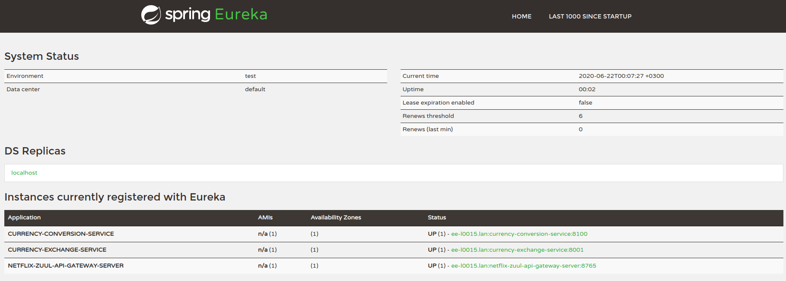

## Zipkin Distibuted Tracing


http://localhost:8761/

http://localhost:9411/zipkin


- Added below dependecy each other microservices

```
    <dependency>
        <groupId>org.springframework.cloud</groupId>
        <artifactId>spring-cloud-starter-sleuth</artifactId>
    </dependency>
    <dependency>
        <groupId>org.springframework.cloud</groupId>
        <artifactId>spring-cloud-starter-zipkin</artifactId>
    </dependency>
    <dependency>
        <groupId>org.springframework.amqp</groupId>
        <artifactId>spring-rabbit</artifactId>
    </dependency>
```
- Then, Should add Seluth beat for watching steps, for each other microserives

```
    @Bean
    public Sampler defaultSampler(){
        return Sampler.ALWAYS_SAMPLE;
    }
```

- All microservices should running. Check from eureka!
http://localhost:8761/


- send one request

http://localhost:8100/currency-converter-feign/from/EUR/to/INR/quantity/10000

- checking the zipkin dashboard

http://localhost:9411/zipkin


What is distributed tracing?
Distributed tracing is a technique used to profile and monitor applications, especially those built using the microservice architecture. Distributed tracing, also called distributed request tracing. IT and DevOps teams can use distributed tracing to monitor applications.

It identifies the failed microservices or the services having performance issues when there are many services call within a request. It is very useful when we need to track the request passing through the multiple microservices. It is also used for measuring the performance of the microservices.